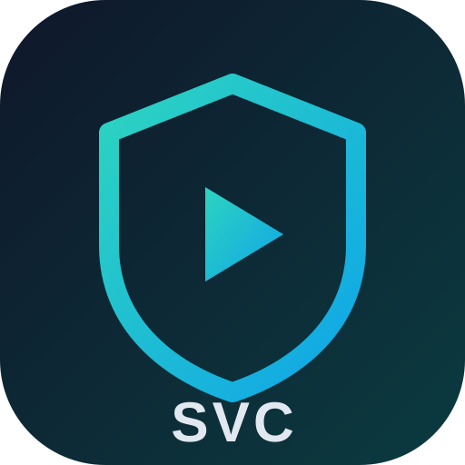
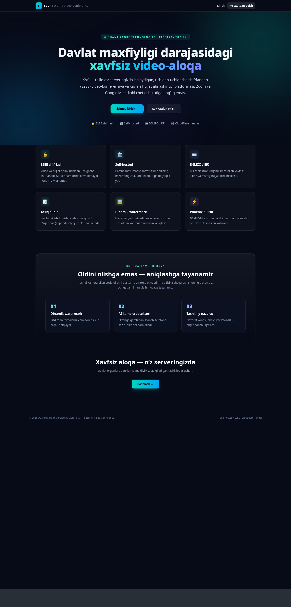
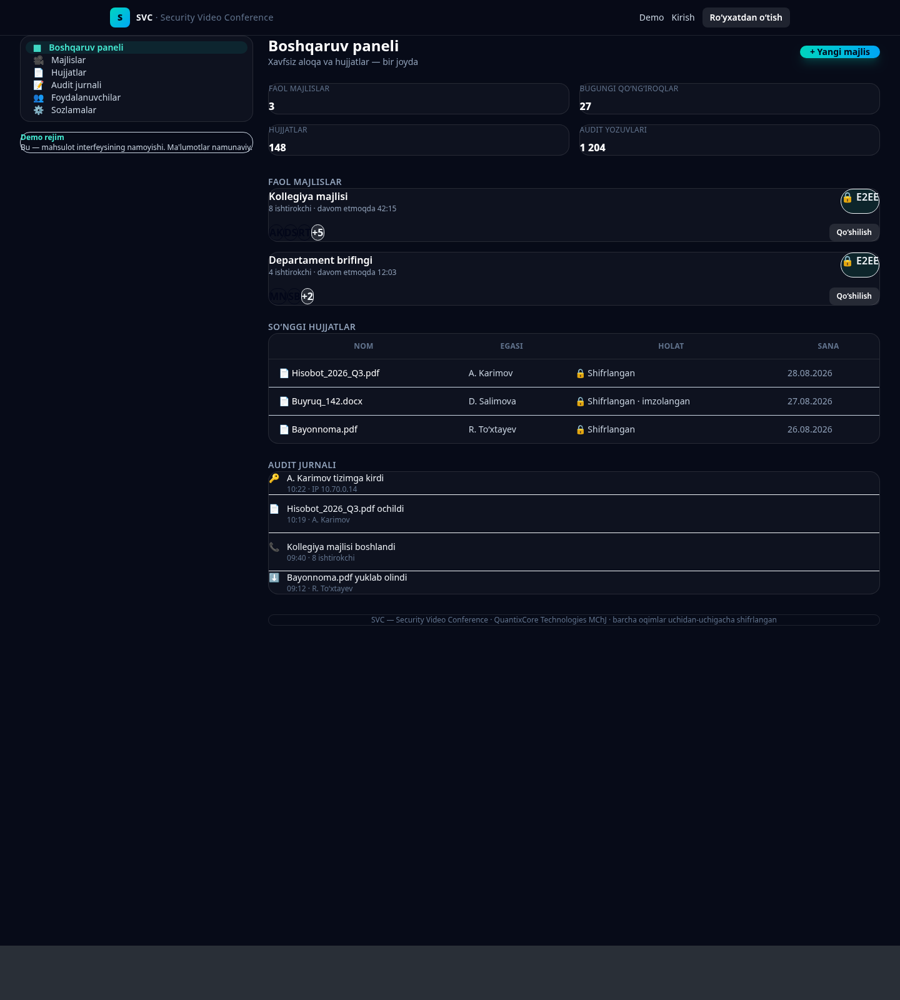
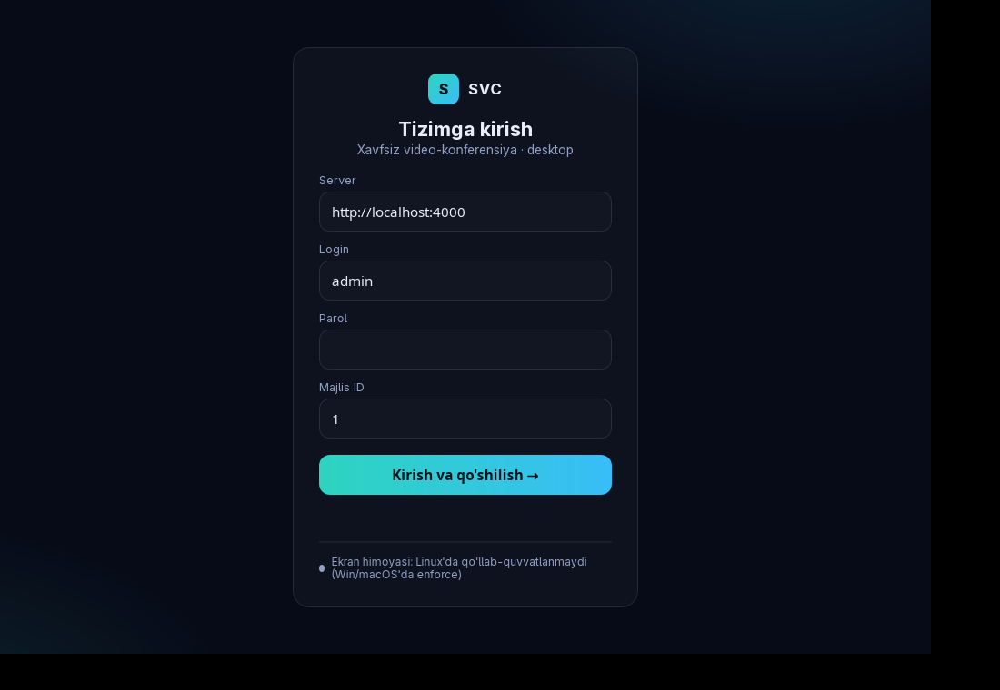
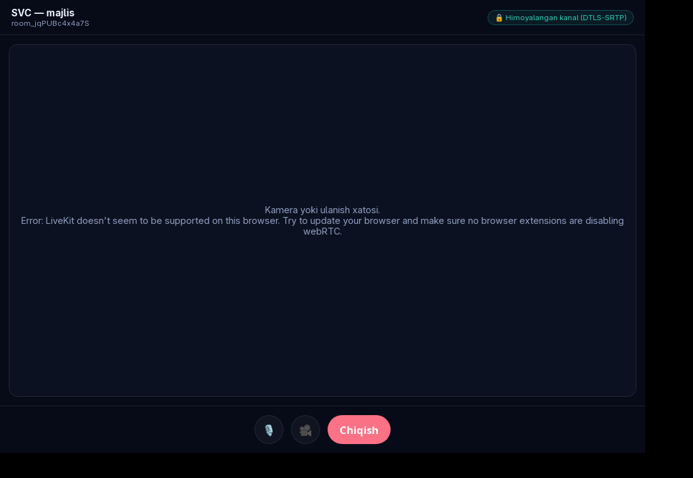

<div align="center">



# SVC — Security Video Conference

**Self-hosted, uchidan-uchigacha shifrlangan video-konferensiya platformasi**
davlat organlari va maxfiylik talab qiladigan tashkilotlar uchun.

*A sovereign, self-hosted, end-to-end-encrypted video conferencing platform for
government and privacy-critical organizations.*

[](https://elixir-lang.org)
[](https://www.phoenixframework.org)
[](https://livekit.io)
[](https://tauri.app)
[](#)
[](#)

**🌐 Live demo:** [svc.co1nlist.uz](https://svc.co1nlist.uz) · **Taqdimot:** [slayd.co1nlist.uz](https://slayd.co1nlist.uz)

</div>

---

## 🎯 Muammo

Bugun O‘zbekistonda davlat organlari, banklar va yirik korxonalar maxfiy majlislarni
**Zoom, Google Meet, Telegram** kabi chet el bulut xizmatlari orqali yuritmoqda. Bu —
suverenitet xavfi (ma’lumot chet el serverlarida), sizib chiqish, audit yo‘qligi va
ma’lumotlarni lokalizatsiya qilish qonuniy talablariga ziddir.

## ✅ Yechim

**SVC** — barcha ma’lumot va infratuzilma **to‘liq tashkilot nazoratida** bo‘lgan platforma:
chet el bulutiga bog‘liq emas, o‘z serveringizda ishlaydi, uchidan-uchigacha shifrlangan.

---

## ✨ Asosiy imkoniyatlar

<table>
<tr>
<td width="33%" valign="top">

### 📹 Video
- LiveKit (self-host SFU) real-time video/audio
- Ekran ulashish, chat, ishtirokchilar paneli
- Veb · Desktop (Tauri) · Mobil (Kotlin)
- Majlisdan ejeksiya, per-user boshqaruv

</td>
<td width="33%" valign="top">

### 🛡️ Xavfsizlik
- TOTP 2FA · Argon2 · sessiya himoyasi
- Per-user **watermark** (izlanuvchi)
- Anti-capture siyosati (warn/eject)
- FLAG_SECURE (Android) · contentProtected (Win)
- O‘zgarmas (append-only) **audit** jurnali

</td>
<td width="33%" valign="top">

### 🌍 Boshqaruv
- Tashkilot ierarxiyasi + **RBAC**
- Davomat (kim keldi / kim kechikdi)
- Rejalashtirish · kalendar · eslatma · .ics
- Topshiriqlar (**Kanban**)
- Geo-siyosat + **spoofing** aniqlash

</td>
</tr>
</table>

---

## 🖼️ Ekran ko‘rinishlari

| Veb interfeys | Video qo‘ng‘iroq (veb) |
|:---:|:---:|
|  |  |
| **Desktop — kirish (Tauri)** | **Desktop — video** |
|  |  |

---

## 🧱 Texnologiyalar

| Qatlam | Texnologiya |
|--------|-------------|
| Backend | **Elixir / Phoenix** umbrella (`svc` core + `svc_web`), LiveView |
| Ma’lumotlar bazasi | **PostgreSQL** (Ecto, har jadval `org_id`-scoped) |
| Media (SFU) | **LiveKit** (self-host) — hop-by-hop DTLS-SRTP |
| Fon vazifalar | **Oban** (davomat, eslatma, egress) |
| Shifrlash | **Cloak** (at-rest) · Argon2 · TOTP |
| Desktop | **Tauri v2** (Rust + WebView + LiveKit JS) |
| Mobil | **Kotlin** + Jetpack Compose + LiveKit Android SDK |
| Tarmoq/Geo | IP-klassifikatsiya + GPS + spoofing (MaxMind/locus — reja) |
| Infratuzilma | **Cloudflare Tunnel** · Docker · systemd |
| Sifat | Credo · **Sobelow** · GitHub Actions CI |

---

## 🏗️ Arxitektura

```
                          ┌─────────────────────────────┐
   Web (LiveView)  ──────►│                             │
   Desktop (Tauri) ──────►│   Phoenix (svc_web)         │──► PostgreSQL (org-scoped)
   Mobile (Kotlin) ──────►│   REST + bearer + WS         │──► Oban (jobs)
                          │   RBAC · Audit · Geo-gate    │──► Cloak (at-rest)
                          └──────────────┬──────────────┘
                                         │ JWT / webhook (HMAC)
                                         ▼
                          ┌─────────────────────────────┐
                          │   LiveKit SFU (self-host)    │  video · egress · eject
                          └─────────────────────────────┘
```

---

## 🚀 Lokal ishga tushirish

```bash
# Talablar: Elixir 1.18 / OTP 27, PostgreSQL, LiveKit (self-host)
mix deps.get
mix ecto.setup                 # baza + migratsiyalar + seed
mix phx.server                 # http://localhost:4000  (admin / AdminPass12345)

# Testlar + sifat darvozasi
mix test                       # 224 test
mix precommit                  # compile(warnings-as-errors) · format · credo · sobelow · test

# Desktop klient
cd desktop && bun run tauri dev
```

---

## 📊 Loyiha holati — **32 / ~40 slice** · 224 test · 0 xato

| Epik | Holat |
|------|-------|
| **E0** Fundament (orgs · RBAC · audit · 2FA) | ✅ |
| **E1** Yadro (LiveKit · jonli video · webhook) | ✅ |
| **E2** Davomat (roster · Oban finalize) | ✅ |
| **E3** Rejalashtirish (kalendar · RSVP · .ics) | ✅ 6/6 |
| **E4** Topshiriqlar (Kanban) | ✅ 4/4 |
| **E5** Anti-capture (watermark · per-meeting siyosat) | ✅ 3/5 |
| **E7** Tarmoq/Geo (gate · siyosat · spoofing) | ✅ 3/5 |
| **i18n** uz/ru/en · **Egress** orkestratsiya · **LiveKit Egress recording** | ✅ |
| Klientlar: **Android** (2FA · GPS · chat/screen-share) · **Tauri desktop** | ✅ |
| **E6** ML (liveness / deepfake) · MaxMind MMDB · iOS | ⬜ / 🔒 reja |

Batafsil: [`docs/CURRENT_STATUS.md`](docs/CURRENT_STATUS.md) · [`docs/SLICES.md`](docs/SLICES.md)

---

## 📚 Dokumentatsiya

- [`docs/ROADMAP.md`](docs/ROADMAP.md) — E0–E7 fazalar dorojnaya kartasi
- [`docs/ARCHITECTURE.md`](docs/ARCHITECTURE.md) — tizim arxitekturasi
- [`docs/ARCHITECTURE_DECISIONS.md`](docs/ARCHITECTURE_DECISIONS.md) — ADR (arxitektura qarorlari)
- [`docs/SLICES.md`](docs/SLICES.md) — slice-tracker (progress manbasi)
- [`docs/security/`](docs/security/) — threat model, shifrlash, anti-capture matritsasi

---

## 🔒 Xavfsizlik falsafasi (halol ramka)

SVC **soxta va’da bermaydi**: tashqi kamera bilan yozib olishni dastur 100% to‘sa
olmasligini ochiq tan olamiz — shuning uchun **oldini olish + aniqlash + sud-ekspertiza**ga
tayanamiz (forensik watermark manbani aniqlaydi; enforce faqat Windows/Android’da).
E2EE off emas, kanal DTLS-SRTP; ma’lumot lokalizatsiyasi va suverenitet — asosiy ustunlik.

---

<div align="center">

**QuantixCore Technologies** · O‘zbekiston 🇺🇿
Made for the President Tech Award — *Best Startup Project*

</div>
